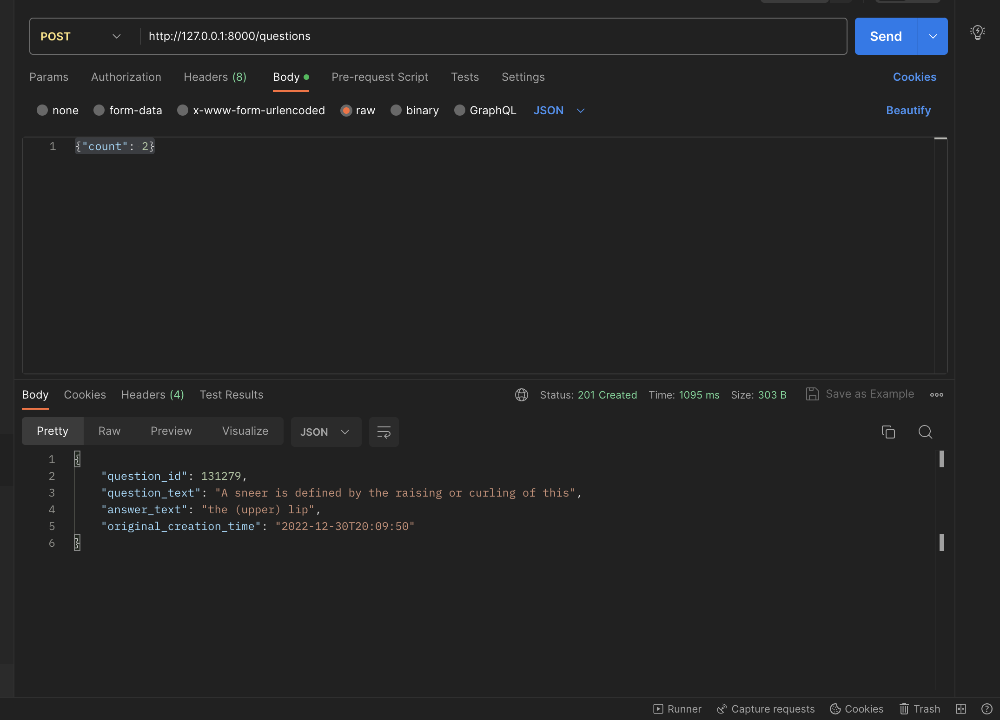

# This is a first part of technical task for one of mine job applications

## Description:
This is a web application which accepts post request from users and then calls an endpoint for required information.  
If request was successful the data should be saved in db.  
The user must receive previously saved data, if none were saved before, then return value should be null.  
Web application and database should be run via docker container.  

### Additional notes:
- Post request endpoint path: /questions
- Body of the request must contain following json data: {"count": "integer"};
- Current implementation also has a sort of "echo" endpoint, by calling root path you will recevied a short instruction how to use service 

## Requirements:
- [Python 3.10](https://www.python.org/downloads/)
- [docker](https://docs.docker.com/get-docker/)
- [docker-compose](https://docs.docker.com/compose/install/)
- [Postman](https://www.postman.com/downloads/)

## Requirements installation:
- pip install -r requirements.txt

## Run project:
to run this service you need to follow this steps

### Run docker-compose file:  

within directory with docker-compose and first_task.Dockerfile files type in terminal:

- docker-compose up -d

### Run migrations:

in terminal type:

- docker-compose app --exec alembic upgrade head

# Example of post request:
